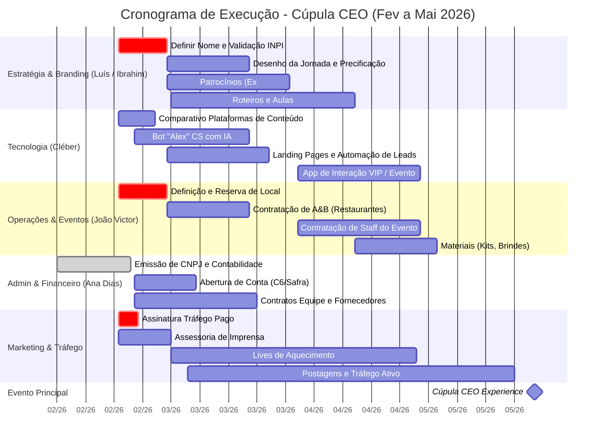

# Diagrama de Execução: Cúpula CEO (Até Maio de 2026)

Este documento detalha as fases, departamentos e responsabilidades para a execução do evento "Cúpula CEO" e estruturação da mentoria de Ibrahim Boufleur e Luís Portal.

## 📊 Fluxograma de Responsabilidades e Cronograma (Gantt)

## 🏢 Departamentos e Task Allocation

### 1. Estratégia, Branding e Relacionamento
**Responsáveis Principais:** Luís Portal e Ibrahim
*   **Prioridade 0:** Registro final do nome "ViDi" e validação na classe 35 do INPI.
*   **Tarefas:**
    *   Desenhar a jornada completa do cliente (Evento → Liderança Antifrágil → Conselheiro/Equity).
    *   Definir roteiros para postagens, vídeos de tráfego e conteúdo de aulas.
    *   Fechar e formalizar parcerias de patrocínio (ex: Ótica San Pietro, Muy Café).

### 2. Tecnologia, Ecossistema e Experiência do Usuário (UX/UI)
**Responsável Principal:** Cléber Donato
*   **Prioridade 0:** Seleção de plataforma de conteúdo e estabilização de automações (AIOS/ClickUp).
*   **Tarefas:**
    *   Desenvolver o Agente de CS com IA (Bot "Alex") para acompanhar o mentorado em sua jornada.
    *   Instalar CRM, ERP e conectar com landing pages para captação de leads.
    *   Plataforma de interação no evento (sorteios, Q&A dinâmico).

### 3. Operações, Logística e Eventos
**Responsável Principal:** João Victor Lopes Rosa
*   **Prioridade 0:** Reservar o local definitivo para o evento de maio.
*   **Tarefas:**
    *   Mapear e contatar opções de alimentação (República da Saúde, Reserva 35, etc.).
    *   Fazer o levantamento de orçamentos para materiais (brindes, estrutura, audiovisual).
    *   Montar a equipe de staff e recepcionistas.

### 4. Backoffice Administrativo e Financeiro
**Responsável Principal:** Ana Dias
*   **Prioridade 0:** Conclusão das contas bancárias (C6/Safra) e setup do ASAAS.
*   **Tarefas:**
    *   Auditar contratos da equipe interna e prestadores de serviço terceirizados.
    *   Garantir a liberação de cartões do CNPJ Cúpula CEO.
    *   Garantir fluxo contábil em dia para pagamento de tráfego e infraestrutura.

### 5. Marketing, Tráfego e Relações Públicas
**Responsáveis:** Equipe Terceirizada (Bruno Lesche / Karol) sob coordenação de Luís/João
*   **Prioridade 0:** Contrato de tráfego pago assinado e rodando.
*   **Tarefas:**
    *   Subir campanhas de captação após definição do Nome.
    *   Gerenciar o calendário de "Lives de Aquecimento" a partir de Março.
    *   Acionar mídia local/assessoria de imprensa para amplificar a autoridade do Ibrahim.
