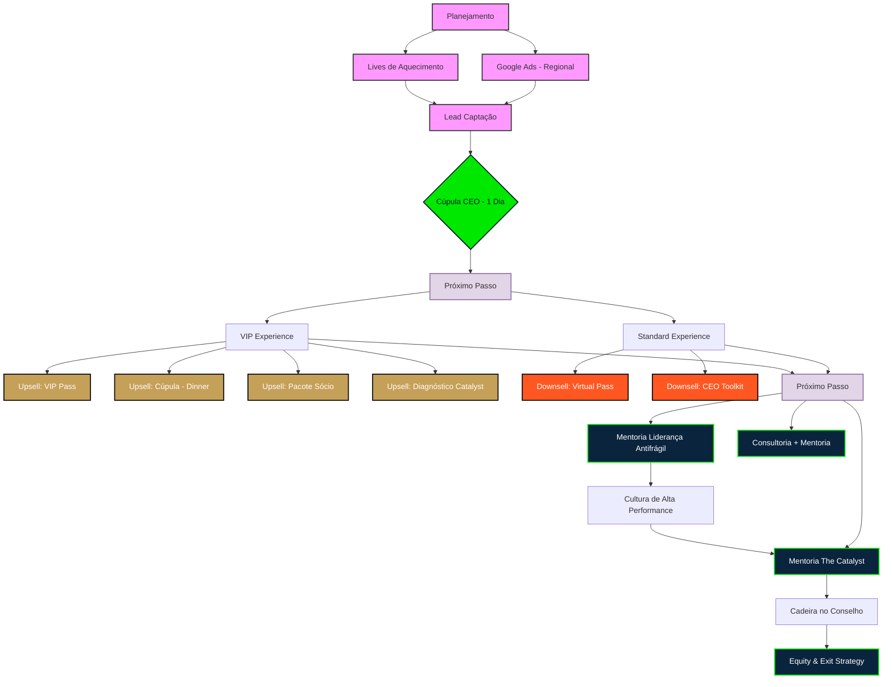

# Jornada do Cliente: VIDI & Cúpula CEO (The Catalyst)

Este documento detalha o fluxo de experiência do cliente, desde a atração inicial até as mentorias de alta cúpula, conforme definido no planejamento de Fevereiro/2026.

## 📊 Fluxograma Visual da Jornada

---

## 🧭 Detalhamento das Fases & Produtos

### 1. Ingressos & Lotes (Cúpula CEO)
*   **Lote 1 (Early Bird):** R$ 1.197 (Apenas os 50 primeiros).
*   **Lote Nomad (Padrão):** R$ 1.497.
*   **Sócio:** 50% de desconto no segundo ingresso (apenas categoria Standard).

### 2. Upsells Estratégicos
*   **VIP Pass (+ R$ 997):**
    *   Acesso a áreas exclusivas.
    *   Coffee break e Almoço com palestrantes e CEOs.
*   **Upgrade Cúpula (+ R$ 7.997):**
    *   Inclui VIP Pass.
    *   Jantar exclusivo com a cúpula do evento e CEOs.
*   **Diagnóstico Catalyst (R$ 297):**
    *   Pré-diagnóstico empresarial via IA.
    *   Possibilidade do case ser analisado ao vivo pelos CEOs no palco.

### 3. Downsell (Recuperação)
*   **Virtual Pass (R$ 997):**
    *   Acesso online ao evento.
    *   Bônus: Acesso ao curso completo.

### 4. Mentoria & Consultoria
*   **Mentoria Liderança Antifrágil (Luiz Portal):** R$ 39.997.
*   **Mentoria The Catalyst (Ibrahim Boufleur):** R$ 100.000.
*   **Consultoria Customizada:** Sob consulta.

---

## 🎮 Gamificação do Evento
Para incentivar o engajamento e a conclusão de tarefas durante o evento:

*   **Regras:** Check-in obrigatório em todas as palestras e tarefas cumpridas.
*   **Brindes por Engajamento:**
    *   Acesso ao curso (para quem cumprir tarefas).
    *   Análise do pré-diagnóstico (para quem já adquiriu o Diagnóstico Catalyst).
    *   Livro autografado.
*   **Premiação Top 3 (Ranking de Gamificação):**
    *   **Diagnóstico Completo** feito pelo time de especialistas da Catalyst.

