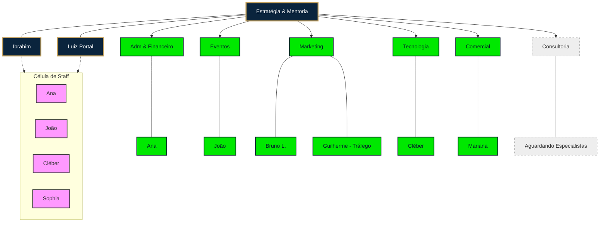

# Estrutura Organizacional: VIDI & Cúpula CEO

Este documento detalha as funções, responsabilidades e a hierarquia da equipe dedicada ao projeto.

## 📊 Organograma Funcional

---

## 👥 Atribuições e Responsabilidades

### 🏛️ Estratégico (Conselho & Mentores)
*   **Ibrahim:** Visão master, estratégia de Equity/Exit e mentor principal do *ViDi*.
*   **Luiz Portal:** Estratégia executiva, cultura organizacional e mentor de *Liderança Antifrágil*.

### ⚙️ Operacional (Lideranças de Setor)
*   **Ana (Adm & Financeiro):** Gestão de caixa, contratos e saúde administrativa do projeto.
*   **João (Organização de Eventos):** Logística, produção e entrega da *Cúpula CEO* e imersões.
*   **Bruno L. (Marketing):** Branding, posicionamento e comunicação estratégica.
*   **Guilherme (Tráfego):** Gestão de anúncios e aquisição de leads qualificados.
*   **Cléber (Tech):** Infraestrutura digital, governança via IA (ClickUp/AIOS) e automações.
*   **Mariana (Comercial):** Vendas, fechamento de mentorias e relacionamento com clientes.
*   **Consultoria (Em aberto):** Setor aguardando a entrada de especialistas para entrega técnica pontual aos mentorados.

### 🍱 Célula de Staff (Suporte Transversal)
Grupo focado na execução de suporte direto aos fundadores e suporte operacional ao evento.
*   **Integrantes:** Ana (Adm), João (Eventos), Cléber (Tech) e Sophia.
